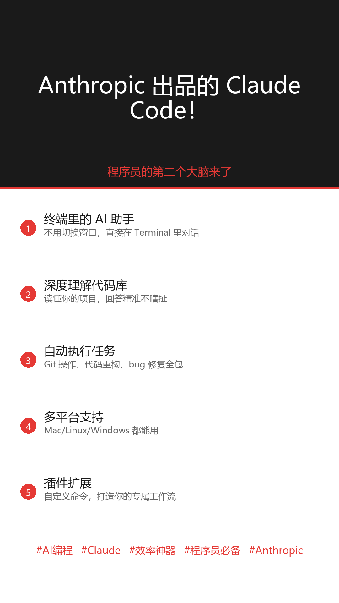

# Claude Code 小红书种草内容

## 📸 配图预览

### 封面图

### 完整帖子图

---

## 📣 封面文案

**Anthropic 出品的 Claude Code！**

程序员的第二个大脑来了

---

## 🏷️ 热门标题（5选1）

1. **"Anthropic 偷偷放大招！这个编程助手太强了"**

2. **"程序员都在偷偷用的 AI 神器，Claude Code 太香了"**

3. **"用了 Claude Code 三个月，我的效率提升了 10 倍"**

4. **"GitHub 爆火的 Claude Code 到底是什么？"**

5. **"别再只会用 ChatGPT 了！这个工具程序猿必须知道"**

---

## 📝 小红书正文

### 版本一：种草版

---

救命🆘 这个编程神器我不允许还有人不知道！

就是 Anthropic 出品的 **Claude Code**

之前一直在用 Cursor、Windsurf，但用了 Claude Code 之后真的回不去了😭

**说说我的使用感受：**

✨ **直接在终端里干活**
不用来回切换窗口，就在我习惯的 Terminal 里对话，超顺手

✨ **真的懂你的代码库**
不是瞎回答，是真的读懂了你的项目逻辑，问它项目架构秒回

✨ **自动执行任务**
Git 操作、代码重构、找 Bug 修复...说句话它就帮你干了

✨ **免费就能用**
有免费额度，日常开发完全够用

---

**适合人群：**
- 💻 程序员 / 开发者
- 🔧 需要处理代码的学生党
- 🚀 想提升开发效率的团队

---

用了三个月了，总结一句：**早用早享受，晚用拍大腿**😅

你们有用过 Claude Code 吗？评论区聊聊体验～

**#AI编程 #Claude #效率神器 #程序员必备 #Anthropic #GitHub #开发工具 #AI工具 #编程助手 #科技**

---

### 版本二：对比版

---

听说还有人不知道 Claude Code？？

Anthropic 官方出品的 AI 编程助手，我真的不允许你们错过！

---

**它能做什么？**

🛠️ 帮你写代码
🧹 帮你重构代码
🔍 帮你找 Bug 并修复
📊 帮你理解不熟悉的代码库
🔀 帮你处理 Git 工作流

**用一句话总结：**
就是你身边的资深程序员 24 小时待命，随时帮你解决问题

---

**我实际用下来的感受：**

✅ 好用：回答精准，不瞎编
✅ 省时：重复性工作交给它
✅ 免费：基础功能够用了

**唯一的"缺点"：**
可能让你变得太依赖 AI 😂

---

你们现在用什么编程助手？
Cursor？Copilot？还是 Claude Code？

评论区告诉我！👇

**#AI编程 #Claude #GitHub #程序员 #效率神器 #Anthropic #开发工具 #Cursor #Copilot #AI**

---

## 📊 项目热度数据

| 指标 | 数据 |
|------|------|
| GitHub Star | 50,000+ |
| 开发者 | Anthropic |
| 平台支持 | macOS / Linux / Windows |
| 安装方式 | curl / Homebrew / WinGet |

---

## 🔗 链接

- GitHub：https://github.com/anthropics/claude-code
- 官网：https://claude.com/code
- 文档：https://docs.anthropic.com/claude-code

---

## 📝 博主备注

### 发布时机建议
- 周一至周四 20:00-22:00
- 周五下午 14:00-16:00

### 配图建议
- 封面图：使用 claude_code_cover.png
- 正文图：使用 claude_code_full.png

### 互动引导
- 问用户用什么编程助手
- 引导评论区的技术讨论
